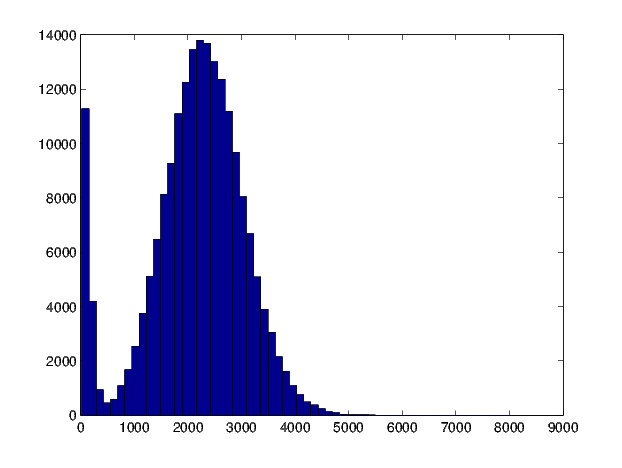
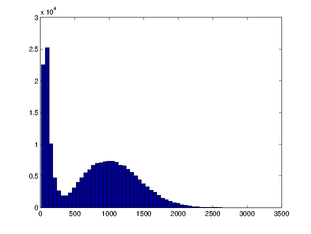
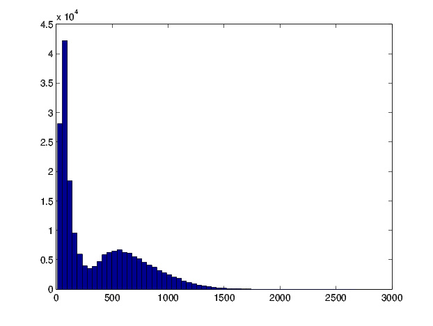
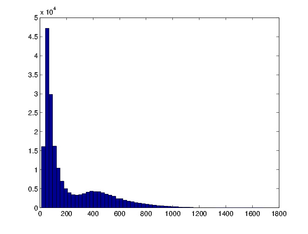
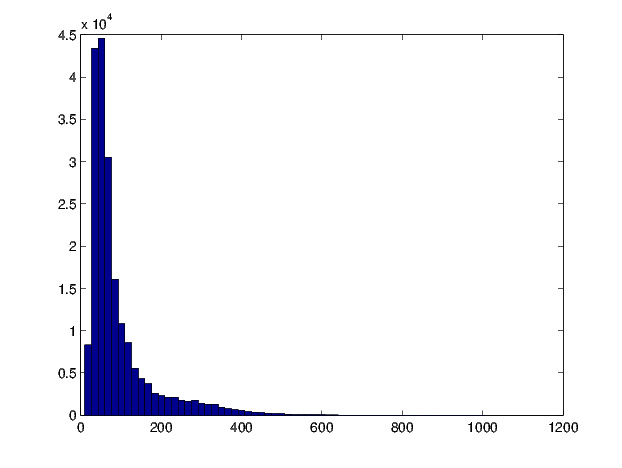
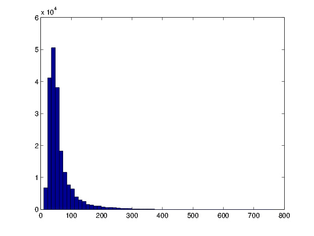
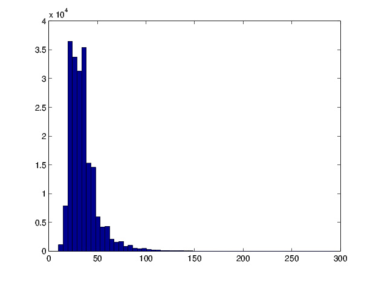

# Superlinear Parallelism Experiment
Simulation of particles that are searching for a target, demonstrating that many particles together do less work in total than fewer particles would do.

### Purpose
Test the proposition that a search task is accomplished with less total effort by many agents together.

### Method
Simulate particles exploring an N-dimensional square world with bounds, in order to find a hidden target. The simulation itself runs completely serially, but conceptualizes the concurrent search.
If multiple agents had to do the same amount of total work as a single agent would, the time to complete the task would be expected to be divided by the number of agents, plus any communication overhead. But in fact, the more agents that work concurrently, the less total work that needs to be done.

## The Simulation in details
### The world
The world is represented by an N-dimensional discrete space with limits +-B in every dimension, thus forming a tiled hypercube. The boundaries are reflective and all the particles begin at the center of the world.
The simulation progresses in discrete time steps, during which each particle in sequence moves exactly once and leaves a mark on the tile it occupies. Thus, each tile holds a value that represents how many times a particle has been there (any particle).

### The particles
They are defined by their position vector in the world. Each particle implements a move strategy that selects one of the adjacent positions in the hypercube to move into each timestep.

#### Move strategy
The moves are random, but not uniformly so. In order to implement a reasonably intelligent search strategy, but at the same time keep the decision cost low, only local information from the adjacent tiles that are move candidates is considered. The strategy is as follows:
1. Double the value of the currently occupied tile
2. Read the values of all adjacent tiles (unsigned-32bit format). Each value has only 1 bit set
3. Calculate a weight by approximately mirroring the set bit's position around the middle of the word, eg:
  - Bit 0 -> bit 30
  - Bit 1 -> bit 29
  - Bit 28 -> bit 2
4. Pick an exponentially-distributed random value: the log2 of rand(), whose peak is the value 30
5. Select the subset of valid moves that have a weight no bigger than the random value
6. If multiple moves remain, pick 1 almost-uniformly
7. Move to selected tile

## Results
The first [results](logs/results3_nexp2e5) support this proposition: doubling the number of particles cuts the time to about 1/4 the original. Here are some examples for a 2-dimensional world, with the target 10 tiles away from the particle starting point and with a boundary 14 tiles away from the start.

### Histograms for time-to-target
1 particle: Mean time 2150

2 particles: Mean time 753

3 particles: Mean time 367

4 particles: Mean time 219

7 particles: Mean time  92

10 particles: Mean time 61

20 particles: Mean time 35

